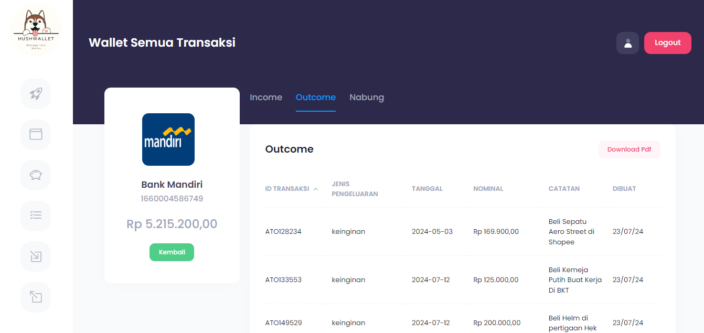

## Hush Wallet
Hush Wallet adalah aplikasi manajemen keuangan pribadi yang dirancang untuk membantu Anda melacak semua aspek keuangan mulai dari income, outcome, dan tabungan. Hush Wallet membuat pengelolaan keuangan menjadi mudah dan menyenangkan.

Fitur:
- Management pemasukan
- Management pengeluaran
- Setting goals 
- Management tabungan

## Role
1. Admin
2. User

## Account
1. email: admin@hush.com | pass: asdf
2. email: andarutr@gmail.com | pass: asdf

## Tech Stack
1. Bootstrap
2. Laravel
3. jQuery
4. Ajax
5. MySQL

## Screenshot
<h5>Register</h5>

<h5>Login</h5>

<h5>Dashboard</h5>

<h5>Tambah Wallet</h6>

<h5>Wallet Transaksi Income</h5>

<h5>Wallet Transaksi Outcome</h5>

<h5>Wallet Transaksi Tabungan</h5>

<h5>Tabungan</h5>

<h5>Goals</h5>

<h5>List Income</h5>

<h5>Tambah Income</h5>

<h5>Laporan Income</h5>

<h5>List Outcome</h5>

<h5>Tambah Outcome</h5>

<h5>Laporan Outcome</h5>

